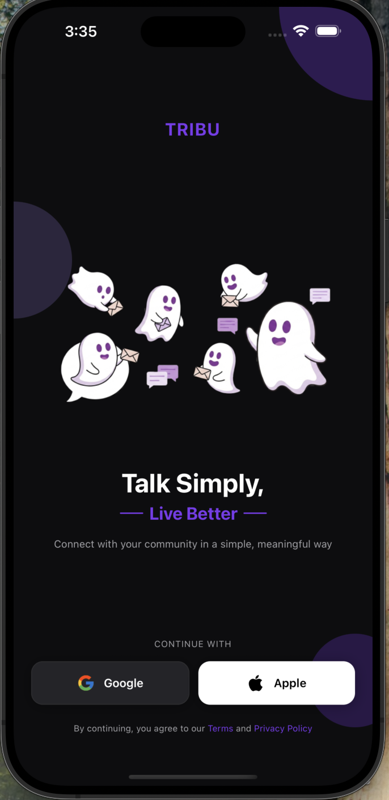
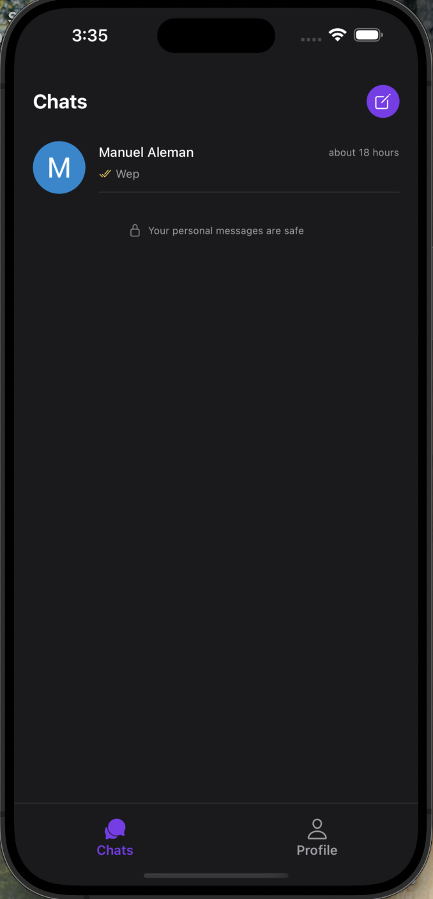
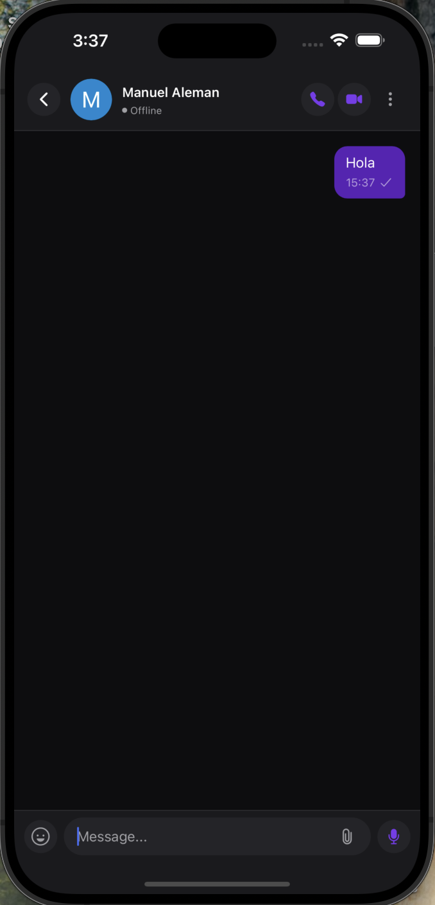
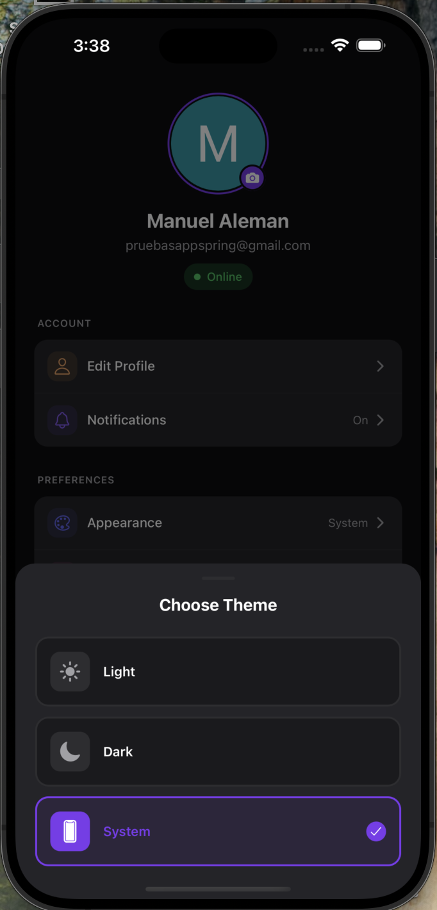

# Tribu

> Real-time chat application built with React Native (Expo) and Express.


## Screenshots

<table align="center">
  <tr>
    <td align="center"><br /><sub>Login</sub></td>
    <td align="center"><br /><sub>Light Theme</sub></td>
    <td align="center"><br /><sub>Chats</sub></td>
    <td align="center"><br /><sub>Messages</sub></td>
    <td align="center"><br /><sub>Profile</sub></td>
  </tr>
</table>

## Features

- **Real-time chat** with Socket.IO
- **Authentication** with Clerk (includes social OAuth)
- **Dark mode** with automatic system support
- **Cross-platform** - iOS, Android and Web
- **Fast backend** with Bun runtime
- **Modern UI** with NativeWind (TailwindCSS)

## Tech Stack

### Frontend (Mobile)
| Technology | Description |
|------------|-------------|
| [Expo](https://expo.dev/) | React Native framework |
| [React Native](https://reactnative.dev/) | Cross-platform framework |
| [Expo Router](https://docs.expo.dev/router/introduction/) | File-based navigation |
| [NativeWind](https://www.nativewind.dev/) | TailwindCSS for React Native |
| [TanStack Query](https://tanstack.com/query) | Server state management |
| [Zustand](https://zustand-demo.pmnd.rs/) | Global state management |
| [Clerk](https://clerk.com/) | Authentication |
| [Socket.IO Client](https://socket.io/) | Real-time communication |

### Backend
| Technology | Description |
|------------|-------------|
| [Bun](https://bun.sh/) | JavaScript runtime |
| [Express](https://expressjs.com/) | Web framework |
| [MongoDB](https://www.mongodb.com/) | Database |
| [Mongoose](https://mongoosejs.com/) | MongoDB ODM |
| [Socket.IO](https://socket.io/) | WebSockets |
| [Clerk](https://clerk.com/) | Authentication |

## Project Structure

```
tribu/
├── backend/              # REST API + WebSocket server
│   ├── src/
│   │   ├── config/       # Configuration (DB, etc.)
│   │   ├── controllers/  # Business logic
│   │   ├── middleware/   # Auth, error handling
│   │   ├── models/       # Mongoose models
│   │   ├── routes/       # Route definitions
│   │   └── utils/        # Utilities (socket, etc.)
│   └── package.json
│
├── mobile/               # React Native app
│   ├── app/              # Routes (Expo Router)
│   │   ├── (auth)/       # Authentication screens
│   │   ├── (tabs)/       # Main tabs
│   │   ├── chat/         # Chat screen
│   │   └── new-chat/     # New chat
│   ├── components/       # Reusable components
│   ├── hooks/            # Custom hooks
│   ├── lib/              # Utilities and configuration
│   ├── providers/        # Context providers
│   └── package.json
│
└── Dockerfile            # Docker configuration
```

## Quick Start

### Prerequisites

- [Node.js](https://nodejs.org/) v18+
- [Bun](https://bun.sh/) (for the backend)
- [MongoDB](https://www.mongodb.com/) (local or Atlas)
- [Expo CLI](https://docs.expo.dev/get-started/installation/)
- [Clerk](https://clerk.com/) account (for authentication)

### 1. Clone the repository

```bash
git clone https://github.com/your-username/tribu.git
cd tribu
```

### 2. Setup Backend

```bash
cd backend
bun install
```

Create `.env` file:
```env
PORT=3000
NODE_ENV=development
MONGODB_URI=mongodb://localhost:27017/tribu
CLERK_SECRET_KEY=sk_test_...
FRONTEND_URL=http://localhost:8081
```

Start the server:
```bash
bun run dev
```

### 3. Setup Mobile

```bash
cd mobile
npm install
```

Create `.env` file:
```env
EXPO_PUBLIC_API_URL=http://localhost:3000/api
EXPO_PUBLIC_SOCKET_URL=http://localhost:3000
```

Start the app:
```bash
npm start
```

> For more detailed instructions, check out the specific READMEs:
> - [Backend README](./backend/README.md)
> - [Mobile README](./mobile/README.md)

## Docker

Run the backend with Docker:

```bash
docker build -t tribu-backend .
docker run -p 3000:3000 --env-file ./backend/.env tribu-backend
```